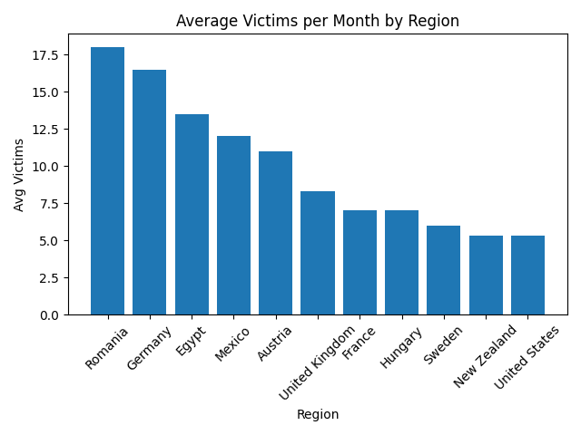
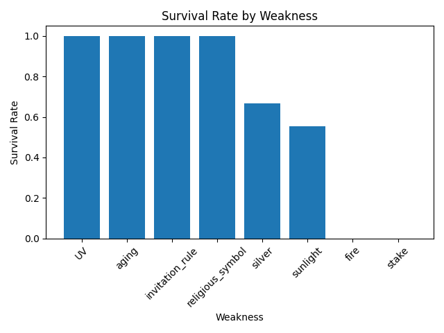
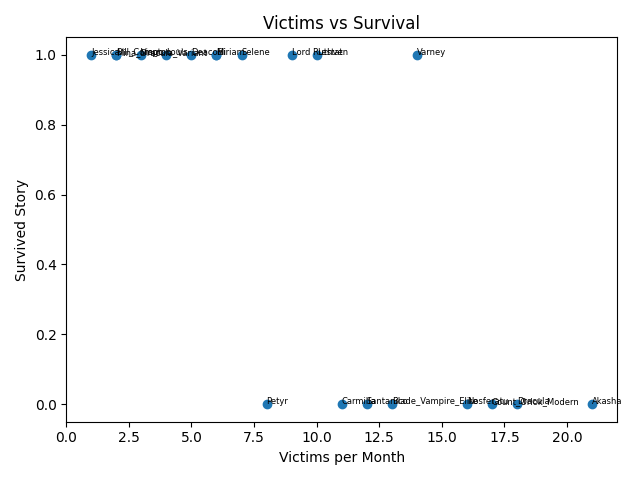

# Vampire Lore Data Analysis

## Overview
This project explores a fictional vampire dataset using Python, pandas, and matplotlib. The aim was to practise data cleaning, exploratory analysis, grouping, and visualisation using a theme that is memorable and easy to explain.

## Visualisations

### Average Victims per Month by Region

### Survival Rate by Weakness

### Victims vs Survival

## Dataset
The dataset includes fictional vampire characters and variables such as:
- origin region
- century
- feeding type
- weakness
- transformation ability
- social class
- estimated victims per month
- whether the vampire survived the story

## Tools Used
- Python
- pandas
- matplotlib
- Google Colab / Jupyter Notebook

## Key Analysis
The analysis focused on:
- comparing average victims per month across regions
- exploring survival rate by weakness
- analysing whether transformation ability related to victim count
- comparing patterns across centuries

## Example Insights
- vampires associated with sunlight weakness tended to have lower survival outcomes
- some regions showed higher average victim counts than others
- transformation ability did not always correspond to higher predation rates

## Files
- `vampire_lore_dataset.csv`
- `vampire_lore_analysis.py`
- `vampire_lore_analysis.ipynb`

## Future Improvements
- expand the dataset with more folklore traditions
- add interactive dashboards
- include time-series analysis by publication period
